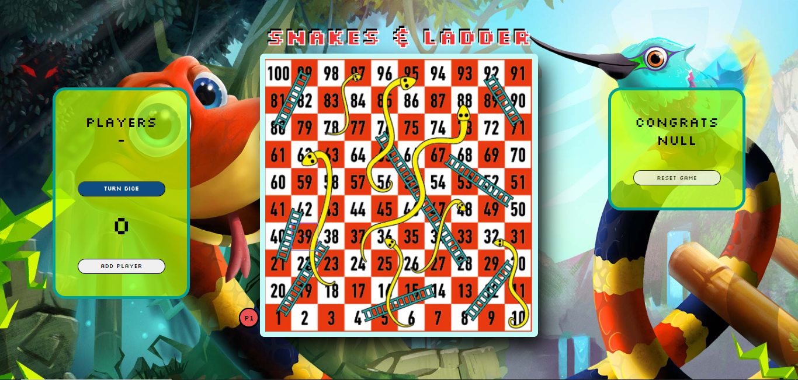

# GAMES ULAR TANGGA

# DESKRIPSI :

Ular tangga adalah permainan papan untuk anak-anak yang dimainkan oleh 2 orang atau lebih.
Papan permainan dibagi dalam kotak-kotak kecil dan di beberapa kotak digambar sejumlah "tangga" atau "ular" yang menghubungkannya dengan kotak lain

# KETENTUAN :

Setiap pemain mulai dengan bidaknya di kotak pertama (biasanya kotak di sudut kiri bawah) dan secara bergiliran melemparkan dadu. Bidak dijalankan sesuai dengan jumlah mata dadu yang muncul. Bila pemain mendarat di ujung bawah sebuah tangga, mereka dapat langsung pergi ke ujung tangga yang lain. Bila mendarat di kotak dengan ular, mereka harus turun ke kotak di ujung bawah ular. Pemenang adalah pemain pertama yang mencapai kotak terakhir.
